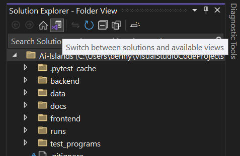

# Ai-Islands

## Set-up

### Step 1: Set Up Python Environment

1. Open **Visual Studio Code**

2. Create and activate a Python virtual environment (venv) using the terminal:
   ```shell
   python -m venv venv
   source venv/bin/activate  # On macOS/Linux
   venv\Scripts\activate      # On Windows

3. Navigate to the root directory of the repository

4. Install the necessary Python packages:

```shell
pip install -e .
```

```shell
pip install -r backend/requirements.txt
```


### Step 2: Install Visual Studio

3. Open **Visual Studio Installer**

4. Install **Visual Studio Community 2022** with the following packages:
    - Python Development
    - .NET Multi-platform App UI (MAUI) Development


## To launch the backend server

### Development Mode
To launch the backend server in **development** mode:
```shell
fastapi dev backend/api/main.py
```

### Production Mode
To launch the backend server in **production** mode:
```shell
fastapi run backend/api/main.py
```

## To launch the frontend

1. Open **Visual Studio Community 2022**
2. Open the local git repository folder
3. Navigate to **solution explorer**
4. Click on **Switch between solutions and available views**



5. Double-click on `AiIslands.sln` to open the solution


6. On the top ribbon, there are two buttons with green arrow icons:
    - Click the one labeled **Windows Machine** to launch in debug mode.
    - Click the other one (without a label) to launch without debugging.
    

